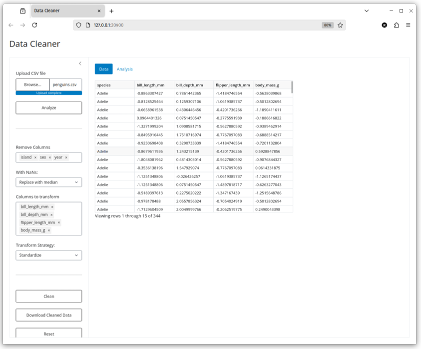
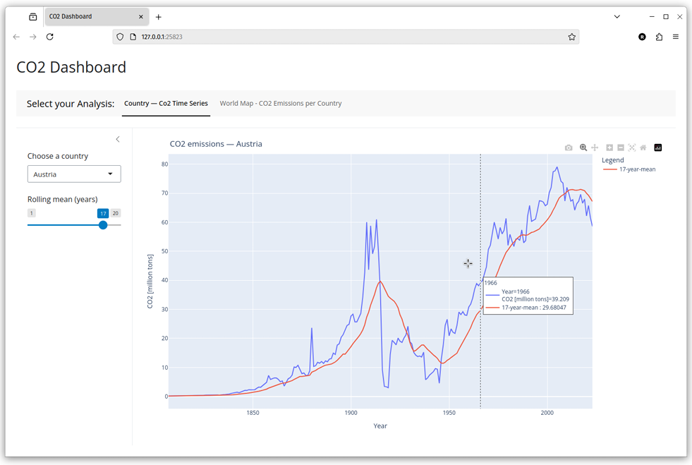
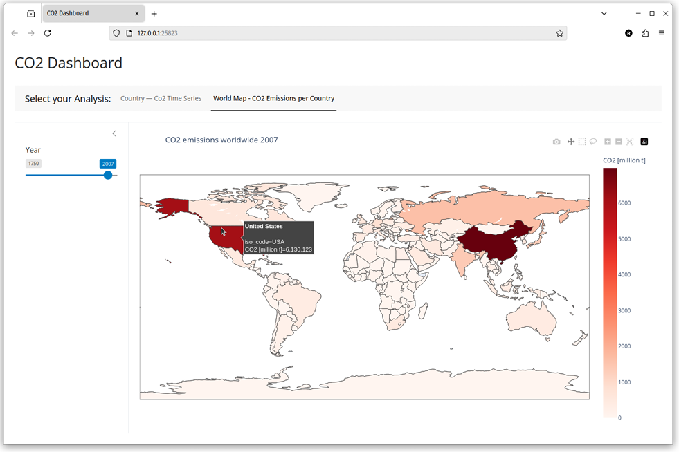

# Shiny Python Applications

This repository showcases interactive web applications built using **Shiny for Python**, demonstrating how to build modern, browser-based user interfaces with reactive behavior entirely in Python.

## 📁 Project Overview

This repository contains two educational web apps:

### 1. 🧹 Data Cleaner (`a4_ex1`)
A lightweight data preprocessing tool built with Shiny Core. Users can upload CSV files and perform basic cleaning operations:
- Remove selected columns
- Handle missing values (replace or drop)
- Normalize or standardize numeric columns
- Preview cleaned data and download it
- Analyze data structure (e.g., missing values, data types)

### 2. 🌍 CO₂ Dashboard (`a4_ex2`)
An interactive dashboard for exploring global CO₂ emissions using real data from Our World in Data:
- **Time Series View**: Select a country and view its CO₂ emission trend over time with optional rolling mean smoothing.
- **Choropleth Map**: Visualize CO₂ emissions by country for any selected year between 1900–2020.

These apps demonstrate Shiny Core's capabilities for handling reactive values, dynamic UI updates, and integration with libraries like `pandas` and `plotly`.

---

## 🛠️ Setup Instructions

### Requirements
- Python 3.8 or later
- Install dependencies:

```bash
pip install -r requirements.txt
```

### Running an App
Navigate to the app directory and run:

```bash
shiny run --reload --launch-browser --port 0 "app.py"
```
## 📦 Dependencies
- shiny
- pandas
- plotly (for CO₂ dashboard)
- requests (optional, for loading external datasets)

## 📈 Screenshots



## 🤝 Acknowledgements
- Python 2 Course in Johannes Kepler University
- Our World in Data – CO₂ Emissions Dataset
- Inspired by Shiny for R, now available in Python via Shiny for Python
